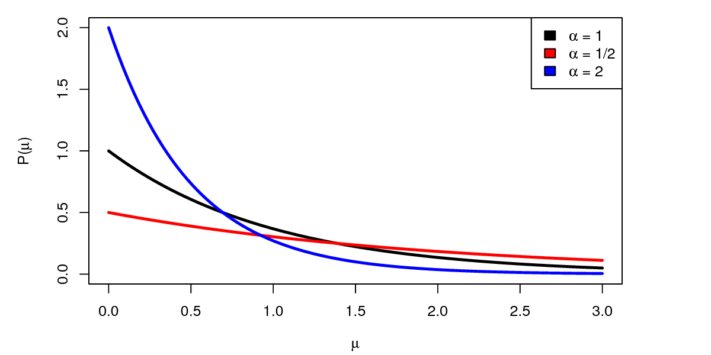
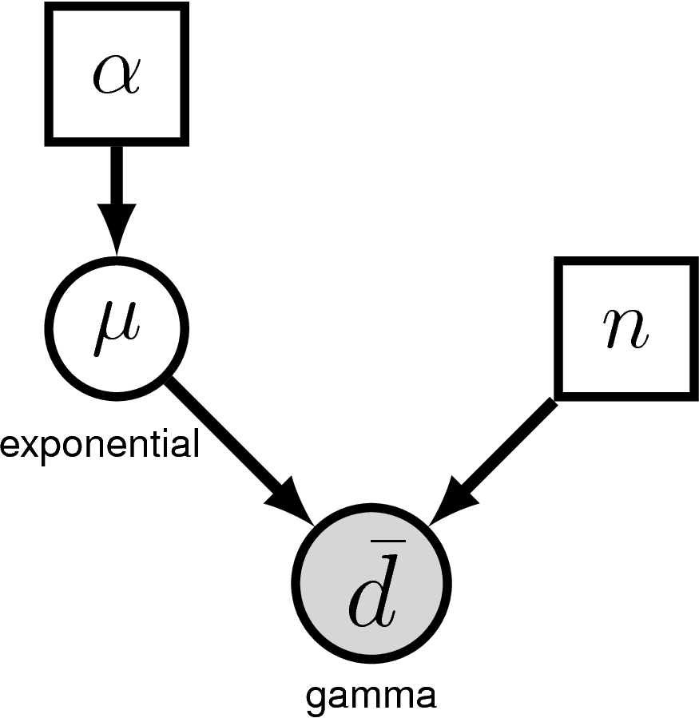
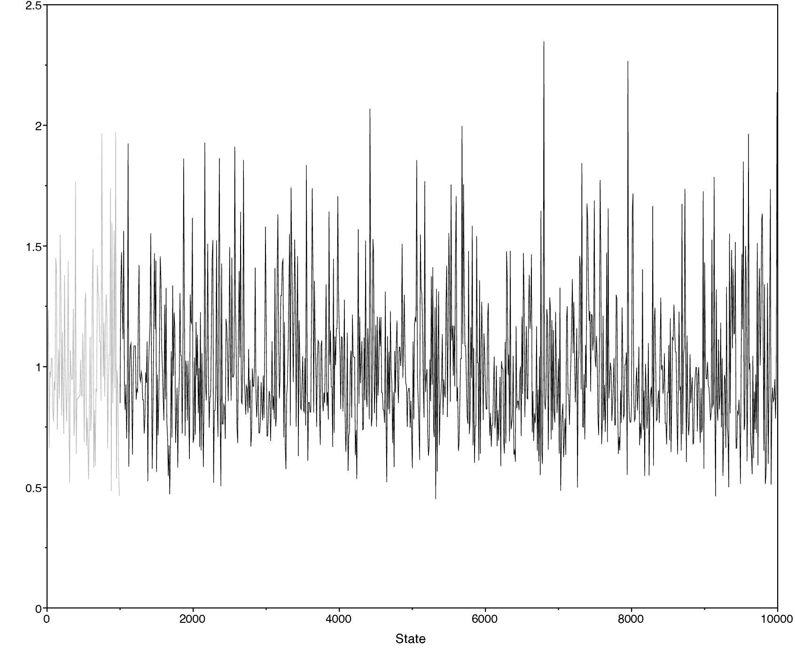
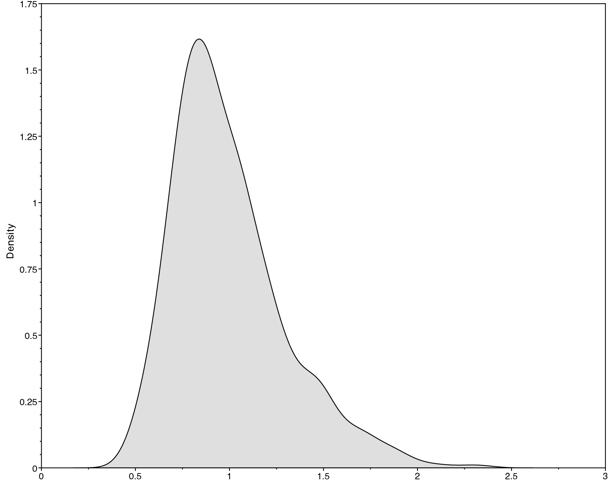
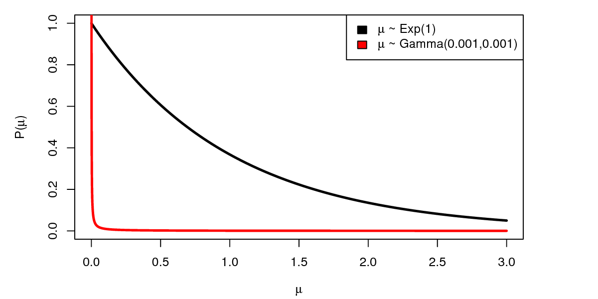

Overview
========


This tutorial is intended to provide a introduction to the basics of
Markov chain Monte Caro (MCMC) using the Metropolis-Hastings algorithm.
This will provide a brief introduction to MCMC moves as well as prior
distributions. We begin with a simple example of estimating the
probability distribution of an archer’s ability to shoot at a target,
and the distance those arrows land from the center. We will simulate
data using this example and attempt to estimate the posterior
distribution using a variety of MCMC moves.

Modeling an Archer’s Shots on a Target
======================================


  

*Representation of the archery data used in this tutorial.Each yellow dot represents the position of an arrow shot by an archer.The distance of each arrow from the the center of the target is assumed to be exponentially distributed with mean $\mu$.*


We’ll begin our exploration of Bayesian inference with a simple archery
model. For this model, there is an unknown archer shooting $n$ arrows at
a target (see ). The distance $d$ of each arrow
from the target’s center is measured. Let’s assume that the distance of
each arrow from the bullseye follows an exponential
distribution—*i.e.,* $d\sim\mbox{Exp}(\mu^{-1})$. This implies the archer has an inherent ability to shoot arrows at an average distance $\mu$. Then, the probability density of each arrow distance $d_i$ is 

$$
\begin{aligned}
P(d_i \mid \mu) = \frac{1}{\mu} e^{-d_i/\mu}.
\end{aligned}
$$ 

Simple intuition suggests that, given that we observe $n$ arrows, a good
estimate of $\mu$ is the average of all the arrow distances
$\bar d = \frac{1}{n}\sum_{i=1}^n d_i$. Indeed this is the maximum
likelihood estimate! In fact, given $n$ arrows whose distances follow an
exponential distribution, it turns out that the observed average
$\bar d$ follows a gamma distribution, with parameters $n$ and $n/\mu$,

$$
\begin{aligned}
P(\bar d \mid \mu,n) = \frac{(n/\mu)^n}{\Gamma(n)} {\bar d}\,^{n-1}e^{-n\bar d /\mu}.
\end{aligned}
$$

In this case, the average $\bar d$ acts as a *sufficient statistic* for
$\mu$. This means that it tells just as much about $\mu$ as the
collection of individual arrow distances. Therefore, we will use a
Gamma$(n, n/\mu)$ distribution on $\bar d$ as the likelihood of our
data.

From Bayes’ theorem, the *posterior distribution* of $\mu$ given
$\bar d$, $P(\mu \mid \bar d)$, is: 

$$
\begin{aligned}
P\left(\mu \mid \bar d\right) = \frac{P\left(\bar d \mid \mu\right) \times P\left(\mu\right)}{P\left(\bar d\right)}
\end{aligned}
$$

Where $P(\mu \mid \bar d)$ is our posterior distribution, $P(\bar d \mid \mu)$ is our likelihood or data distribution, $P(\mu)$ is our prior distribution, and $P(\bar d)$ is our marginal likelihood. The take-home message here is that, if we’re interested in doing Bayesian inference for the archery model, we need to specify a *likelihood function* and a *prior distribution* for $\mu$. In virtually all practical cases, we cannot compute the posterior distribution directly and instead use numerical procedures, such as a Markov chain Monte Carlo (MCMC) algorithm. Therefore, we will also have to write a MCMC algorithm that samples parameter values in the frequency of their posterior probability.

We’ll use a simple exponential distribution as a prior on the parameter of the model, $\mu$. The [exponential distribution](https://en.wikipedia.org/wiki/Exponential_distribution) has one parameter $\alpha$ representing our prior belief about the mean arrow distance (figure, below). Different choices for $\alpha$ represent different prior beliefs.

 

*Exponential distribution with one parameter $\alpha$. This distribution is used as a prior distribution on the average arrow distance $\mu$.Here we show different curves for the exponential distribution when using different parameters.*


 shows the graphical model for the archery model. This nicely visualizes the dependency structure in the model. We see that the parameter $\alpha$ is drawn in a solid square, representing that this variable is constant (*i.e.,* it takes a “known” value). Following the graph in , we see an arrow connecting $\alpha$ and the variable $\mu$. That simply means that $\mu$ depends on $\alpha$. More specifically, $\mu$ is a stochastic variable (shown as a solid circle) that is drawn from an exponential distribution with parameter $\alpha$. Another constant variable, $n$, represents the number of shots taken by the archer. Finally, we have the observed data $\bar d$ which is drawn from a gamma distribution with parameters $\mu$ and $n$, as can be seen by the arrows pointing from those parameters to $d$. Furthermore, the solid circle of $\bar d$ is shaded which means that the variable has data attached to it.

  

*Graphical model for the archery model.*


Writing MCMC from Scratch
=========================


Tutorial Format 
---------------


This tutorial follows a specific format for issuing instructions and
information.

The boxed instructions guide you to complete tasks that are not part of the RevBayes syntax, but rather direct you to create directories or files or similar.

Information describing the commands and instructions will be written in paragraph-form before or after they are issued.

All command-line text, including all `Rev` syntax, are given in `monotype font`. Furthermore, blocks of `Rev` code that are needed to build the model, specify the analysis, or execute the run are given in separate shaded boxes. For example, we will instruct you to create a new variable called `n` that is equal to `10` using the `=` operator like this:

    n = 10

Create Your Script File
-----------------------


Make yourself familiar with the example script called [`archery_MH.Rev`](https://raw.githubusercontent.com/revbayes/revbayes_tutorial/master/RB_MCMC_Archery_Tutorial/archery_MH.Rev) which shows the code for the following sections. Then, start a new and empty script in your text editor and follow each step provided as below.

Name the script file `my_archery_MH.Rev` or anything you’d like.

The Metropolis-Hastings Algorithm
---------------------------------


Though RevBayes implements efficient and easy-to-use Markov chain Monte Carlo (MCMC) algorithms, we’ll begin by writing one ourselves to gain a better understanding of the moving parts. The Metropolis-Hastings MCMC algorithm (Metropolis1953, Hastings1970) proceeds as follows:

1.  Generate initial values for the parameters of the model (in this
    case, $\mu$).

2.  Propose a new value (which we’ll call $\mu^\prime$) for some
    parameters of the model, (possibly) based on their current values

3.  Calculate the acceptance probability, $R$, according to:
    
    $$\begin{aligned}
    R &= \text{min}\left\{1, \frac{P(\bar d \mid \mu^\prime)}{P(\bar d \mid \mu)} \times \frac{P(\mu^\prime)}{P(\mu)} \times \frac{q(\mu)}{q(\mu^\prime)} \right\}\\
      &= \text{min}\left\{1, \text{likelihood ratio} \times \text{prior ratio} \times \text{proposal ratio} \right\},
    \end{aligned}$$
    
    where the proposal ratio (also called the Hastings ratio) ensures the correct target density, even if the move is biased.

4.  Generate a uniform random number $u$ between 1 and 0.

    if $u<R$:

    :  then accept the move and set $\mu = \mu^\prime$.

    else (if $u \geq R$):

    :   the value of $\mu$ does not change and the move is rejected:
        $\mu = \mu$.

5.  Record the values of the parameters.

6.  Return to step 2 many, many times, keeping track of the value of $\mu$.

Reading in the data
-------------------


Since we do not have access to archery data, we will simulate the the shots of our archer using the simulation tools in RevBayes. By simulating the data, we can also evaluate how well our moves and prior model perform—*i.e.,* how robust and accurate our estimators are. After completing this exercise, feel free to repeat it and alter the true values to see how they influence the posterior distribution.

    # Simulate some data (i.e. shoot some arrows)
    # First we need the number of arrows to shoot
    n = 10
    # Then we need a true mean distance
    mu_true = 1
    # Simulate the observed mean distance of the arrows shot from a gamma distribution
    arrow_mean = rgamma(1, n, n/mu_true)[1]

The Rev code above uses the `rgamma()` function to simulate a single
observed `arrow_mean` from $n=10$ arrows shot on target. The `[1]`
following the `rgamma()` function is needed because this function always
returns a *vector* even when we only request a single value. Thus, in
order to treat `arrow_mean` as a single value, we have to request the
first element of the vector returned by that function.

Initializing the Markov chain
-----------------------------


We have to start the MCMC off with some initial values for all of the
parameters. One way to do this is to randomly draw values of the
parameters (just $\mu$, in this case) from the prior distribution. We’ll
assume a simple exponential prior distribution; that is, one with
$\alpha = 1$.

```
# Initialize the chain with some starting value
alpha = 1.0
mu = rexp(1, alpha)[1]
```

### Likelihood function

Next we will specify the likelihood function, which will compute the
probability of our data given the prior model. We use the gamma
distribution for the likelihood. Since the likelihood is defined only
for values of $\mu$ greater than 0, we return a likelihood of 0.0 if
$\mu$ is negative:
```
# Define the likelihood function on the mean
function likelihood(mu){
    if(mu < 0.0)
        return 0.0
    return dgamma(arrow_mean, n, n/mu, log=false)
}
```
In `Rev`, we can create a *user-defined function* using the
`function` keyword. In our function definition above, `likelihood()`
takes a single value as an argument that is expected to be the mean
($\mu$) value. All other parameters in our function are expected to be
defined before `likelihood()` is called.

### Prior distribution

Similarly, we need to define a function for the prior distribution.
Here, we use the exponential probability distribution for the prior on
$\mu$:

```
# Define the prior function on the mean
function prior(mu){
    if(mu < 0.0)
        return 0.0
    return dexp(mu, alpha, log=false)
}
```

### Monitoring parameter values

Additionally, we are going to monitor, *i.e.* store, parameter values into a file during the MCMC simulation. For this file we need to write the column
headers in the first line of our output file, which we will name
`archery_MH.log` (you may have to change the newline characters from
`\n` to `\r\n` if you’re using a Windows operating system.):

```
# Prepare a file to log our samples
write("iteration","mu","\n",file="archery_MH.log")
write(0,mu,"\n",file="archery_MH.log",append=TRUE)
```

We’ll also monitor the parameter values to the screen, so let’s print
the initial values:

```
# Print the initial values to the screen
print("iteration","mu")
print(0,mu)
```

Writing the Metropolis-Hastings Algorithm
-----------------------------------------


At long last, we can write our MCMC algorithm. First, we define how
often we print to file (*i.e.,* monitor); this is called thinning if we do not choose to save every value of our parameter to file. If we set the variable `printgen=1`, then we will store the parameter values at every iteration; if we instead choose `printgen=10`, then we’ll only save the values every $10^{th}$ step in our Markov chain.

```
# Write the MH algorithm    
printgen = 10
```

We will repeat this resampling procedure many times and iterate the MCMC
using a `for` loop (*e.g.,* step 6 in The Metropolis-Hastings Algorithm Section. We will start
this part by defining the number of iterations for our MCMC ( `reps =
10000`), and writing the first line of our ‘for‘ loop. We’ll also define
a variable `delta` (explained momentarily).

```
reps = 10000
delta = 1
for(rep in 1:reps){
```

In `Rev`, the contents of every `for` loop must be enclosed within a set
of ‘curly braces’ . Our loop will not be complete until we finish it and
add the closing brace. Additionally, it is good style to make our loops
readable by indenting the contents within the curly braces. We recommend
that you use 4 spaces to represent these indents.

For our MCMC algorithm, the first thing we do is generate a new value of
$\mu^\prime$ to evaluate (step 2 of the [The Metropolis-Hastings Algorithm Section](#sect:MH_algorithm)). We’ll propose a new value of $\mu$ by
drawing a random number from a uniform window and then adding this
random number to the current value (*i.e.* centered on the previous value). The
value of `delta` defines the width of the uniform window from which we
draw new values. Thus, if `delta` is large, then the proposed values are
more likely to be very different from the current value of $\mu$.
Conversely, if `delta` is small, then the proposed values are more
likely to be very close to the current value of $\mu$. By changing the
value of `delta` we can tune the behavior of the proposal, and therefore
`delta` is called a *tuning parameter*.

```
# Propose a new value of p
mu_prime <- mu + runif(n=1,-delta,delta)[1]
```

Next, we compute the proposed likelihood and prior probabilities using
the functions we defined above, as well as the acceptance probability,
$R$ (step 3 of the The Metropolis-Hastings Algorithm Section):

```
# Compute the acceptance probability
R = ( likelihood(mu_prime)/likelihood(mu) ) * ( prior(mu_prime)/prior(mu) )
```

Then, we accept the proposal with probability $R$ and reject otherwise
(step 4 of the The Metropolis-Hastings Algorithm Section):

```
# Accept or reject the proposal
u = runif(1,0,1)[1]

if(u < R){
# Accept the proposal
    mu = mu_prime 
}
```

Finally, we store the current value of $\mu$ in our log file (step
5 of the the The Metropolis-Hastings Algorithm Section). Here, we actually check if we want to store the value during this iteration.

```
if ( (rep % printgen) == 0 ) {
    # Write the samples to a file
    write(rep,mu,"\n",file="archery_MH.log",append=TRUE)
    # Print the samples to the screen
    print(rep,mu)
}
```

and close the for loop

```
}
```

Execute the MCMC Analysis

Now that you have defined your model and written functions to compute the probability and sample values of $\mu$, you are now ready to run your analysis. 

Begin by running the RevBayes executable. You can do this by navigating to the folder containing your RevBayes executable and running it. If you're on a Unix system you can do this by typing:

```
rb
```
{:.bash}

*Alternatively*, if you are on a Unix system and the RevBayes binary is in your path, you only have to type the following from any directory:

```
rb
```
{:.bash}
Now you can run your RevBayes script:

```
source("my_archery_MH.Rev")
```

Exercise 1
----------


1.  Write and execute the script outlined above, which you can give any
    name you like (there is also an example file
    called `archery_MH.Rev`).

2.  The `.log` file will contain samples from the posterior distribution
    of the model. Open the file in `Tracer` to learn about
    various features of the posterior distribution, for example: the
    posterior mean or the 95% credible interval.

Pretty awesome, right?

Below we show an example of the obtained output in
`Tracer`. Specifically,  shows
the sample trace (left) and the estimated posterior distribution of
$\mu$ (right). There are other parameters, such as the posterior mean
and the 95% HPD (highest posterior density) interval, that you can
obtain from `Tracer`.





The *Trace* of sample from an MCMC simulation. Right: The approximated posterior probability distribution for $\mu$.


More on Moves: Tuning and Weights
=================================


In the previous example we hard coded a single move updating the
variable $\mu$ by drawing a new value from a sliding window. There are
other ways how to propose new values; some of which are more efficient
than others.

First, let us rewrite the MCMC loop so that instead we call a function,
which we name `move_slide` for simplicity, that performs the move:

Slide move
----------


Now we need to actually write the `move_slide` function. We mostly just
copy the code we had before into a dedicated function

There are a few things to consider in the function `move_slide`. First,
we do not have a return value because the move simply changes the
variable $\mu$ if the move is accepted. Second, in addition to the
tuning parameter `delta`, we expect an argument called `weight` which
will tell us how often we want to use this move. Otherwise, this
function does exactly the same what was inside the for loop previously.

(Note that you need to define this function before the for loop in your
script).

Experiment with different values for `delta` and see how the effective
sample size (ESS) changes.

There is, *a priori*, no good method for knowing what values of `delta` are most efficient. However, there are some algorithms implemented in RevBayes, called *auto-tuning*, that will estimate good values for `delta`.

Scaling move
------------


As another move we will write a scaling move. The scaling move proposes
an update by drawing a random number from a $Uniform(-0.5,0.5)$
distribution, exponentiating the random number, and then multiplying
this scaling factor by the current value. An interesting feature of this
move is that it is not symmetrical and thus needs a Hastings ratio (this
is the same as the proposal ratio given in Section
[sect:MH_algorithm]). The Hastings ratio is rather trivial in this
case, and one only needs to multiply the acceptance rate by the scaling
factor.

As before, this move has a tuning parameter called `lambda`.

The sliding-window and scaling moves are very common and popular moves in RevBayes. The code examples here are actually showing the exact same equation as implemented internally. It will be very useful for you to understand these moves.

Exercise 2
----------


1.  Rewrite your previous script to include these two different moves,
    and re-run the script to estimate the posterior distribution of
    $\mu$ again.

2.  Use only a single move and set `printgen=1`. Which move has the best
    ESS?

3.  How does the ESS change if you use tuning parameter values
    `delta=10` or `delta=0.1` for the sliding-window move? What about
    `lambda=10` or `lambda=0.1` for the scaling move?

4.  You can keep track of your results using the following table.

The Metropolis-Hastings Algorithm with the *Real* RevBayes
============================================================


We’ll now specify the exact same model in `Rev` using the built-in
modeling functionality and moves. It turns out that the ‘Rev‘ code to
specify the above model is extremely simple and similar to the one we
used before. Again, we start by “reading in” (*i.e.* making up) our
data.

```
# Simulate some data (i.e. shoot some arrows)
# First we need the number of arrows to shoot
n = 10
# Then we need some true mean distance
mu_true = 1
# Simulate the observed mean distance of the arrows we shot
arrow_mean = rgamma(1, n, n/mu_true)[1]
```

Now we specify our prior model.

```
# Specify the prior distribution
alpha <- 1.0
mu ~ dnExponential(alpha)
```

One difference between RevBayes and the MH algorithm that we wrote
above is that many MCMC proposals are already built-in, but we have to
specify them *before* we run the MCMC. We usually define (at least) one
move per parameter immediately after we specify the prior distribution
for that parameter.

```
# Define a move for our parameter, mu
moves[1] = mvSlide(mu, delta=1, weight=1.0)
```

Next, our likelihood model.

```
# Specify the likelihood model
d_bar ~ dnGamma(n, n/mu)
d_bar.clamp(arrow_mean)
```

We wrap our full Bayesian model into one model object (this is a
convenience to keep the entire model in a single object, and is more
useful when we have very large models):
```
# Construct the full model
my_model = model(mu)
```

We use “monitors” to keep track of parameters throughout the MCMC. The
two kinds of monitors we use here are the `mnModel`, which writes
parameters to a specified file, and the `mnScreen`, which simply outputs
some parts of the model to screen (as a sort of progress bar).

```
# Make the monitors to keep track of the MCMC
monitors[1] = mnModel(filename="archery_RB.log", printgen=10)
monitors[2] = mnScreen(printgen=1000, mu)
```

Finally, we assemble the analysis object (which contains the model, the
monitors, and the moves) and execute the run using the `.run` command:

```
# Make the analysis object
analysis = mcmc(my_model, monitors, moves)
# Run the MCMC
analysis.run(100000)
# Show how the moves performed
analysis.operatorSummary()
```

Open the resulting `archery_RB.log` file in `Tracer`.

Do the posterior distributions for the parameter $\mu$ look the same as the ones we got from our first analysis?

Hopefully, you’ll note that this `Rev` model is substantially simpler
and easier to read than the MH algorithm script we began with. Perhaps
more importantly, this `Rev` analysis is *orders of magnitude* faster
than our own script, because it makes use of extremely efficient
probability calculations built-in to RevBayes (rather than the ones we
hacked together in our own algorithm).

Exercise 3
----------


1.  Run the built-in MCMC and compare the results to your own MCMC. Are
    the posterior estimates the same? Are the acceptance rates of the
    moves similar?

2.  Add a second move `moves[2] = mvScale(mu,lambda=0.1,weight=1.0)`

3.  Run the analysis again and compare the output.

4.  Have a look at how the acceptance rate changes for different values
    of the tuning parameters.

Influence of the Prior
======================


So far we have used a fairly simple exponential prior with $\alpha = 1$.
However, we have not explored what impact this prior has on our estimate
of $\mu$, or whether it is an appropriate prior distribution. If the
prior is very informative, then our posterior distribution will be
relatively similar to our prior beliefs. In order to explore the
informativeness of the prior, we can change the true value of $\mu$ so
that it is very different from our prior belief. If we are still able to
recover the correct value of $\mu$, then we can say that our prior is
fairly uninformative.

If we find that our prior distribution is very informative, we have two
options for minimizing sensitivity to the prior. First, we can use a
less informative prior distribution. For example, since our data is
exponentially distributed, a good choice for an uninformative prior is a
$Gamma(0,0)$ distribution (this is the [Jeffreys prior](https://en.wikipedia.org/wiki/Jeffreys_prior)). Unfortunately,
this prior distribution is *improper* (it does not integrate to 1), and
so we can’t use it in RevBayes. However we can approximate this prior
distribution by using very small parameter values, e.g. $Gamma(0.001,
0.001)$. As you can see in , compared
to the exponential distribution, the $Gamma(0.001, 0.001)$ distribution is
much more “flat”.




Comparison of exponential distribution with $\alpha = 1$ and uninformative gamma distribution with parameters $\alpha=0.001$ and $\beta=0.001$.


The second and simplest way we can overcome the informativeness of the
prior is to increase the amount of data we collect. We can do that in
our example by increasing the number of arrows we shoot.

Exercise 4
----------


1.  Increase the true mean arrow distance so that it is significantly
    larger than $\alpha$. How does this impact your estimate of $\mu$?

2.  Now use an uninformative $Gamma(0.001, 0.001)$ prior for $\mu$. Did
    your estimate of $\mu$ improve?

3.  Increase the number of arrows shot. How does this change the shape
    and scale of the posterior distribution?

